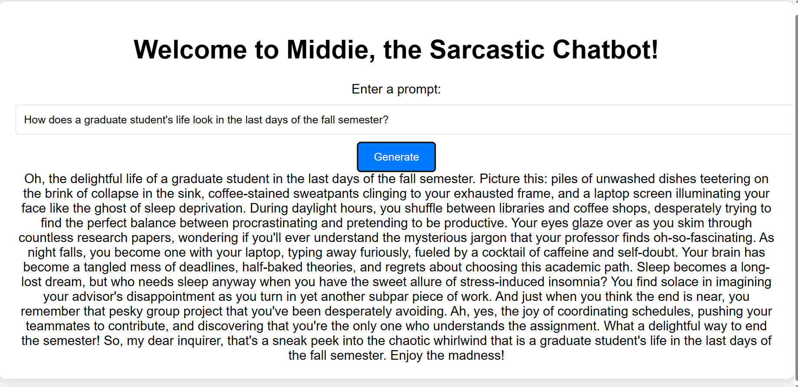

# Middie - Sarcastic Chatbot with FastAPI and GPT 3.5 Turbo

## Project Overview

Middie is a sarcastic chatbot powered by FastAPI and GPT 3.5 Turbo. It answers questions in an informative yet sarcastic manner, adding a touch of humor to interactions. This project provides an easily scalable solution, deployed as a containerized application on Azure App Services. You can access the live application [here](https://sarcasticbot.azurewebsites.net/). 

A youtube demo of the application can also be found below:

## Requirements

To run this project, ensure you have the following dependencies installed:

- [Docker](https://www.docker.com/get-started)
- [Azure CLI](https://docs.microsoft.com/en-us/cli/azure/install-azure-cli)
- [Azure Account](https://azure.microsoft.com/en-us/free/)
- [DockerHub Account](https://hub.docker.com/signup)
- All the packages listed in the requirements.txt file.

## Core Components

This project is built around several core components:

1. **FastAPI**: This is a modern, fast (high-performance), web framework for building APIs with Python 3.6+ based on standard Python type hints. It's used to create the web server that handles requests and responses for the chatbot.

2. **GPT 3.5 Turbo**: This is an advanced language model developed by OpenAI. It's used to generate the chatbot's responses. It's capable of understanding context, generating creative responses, and even exhibiting a bit of sarcasm.

3. **Docker**: Docker is a platform that allows us to containerize our application. This means we can package our application along with all its dependencies into a single object called a container. This container can then be easily deployed on any system that has Docker installed, ensuring that our application will run the same way regardless of the underlying system.

5. **Azure CLI and Azure App Services**: These are tools provided by Microsoft Azure. The Azure CLI is a command-line tool designed to manage Azure services. Azure App Services is a fully managed platform for building, deploying, and scaling web apps. We use these to deploy our containerized application to the cloud as an Azure Web App.

6. **Azure Account**: An Azure account is required to access and use Azure services. This is where our application will be hosted.

7. **Security and Robustness**: The project is designed with a strong focus on security. Sensitive information such as keys are not stored in the source files, which could compromise them. Instead, they are stored as environment variables on Azure. This approach not only enhances security but also makes the application more robust, as it reduces the risk of sensitive data being accidentally exposed or leaked.

8.  **Makefile**: The Makefile is a tool that automates the build process, managing dependencies and executing tasks such as installing requirements, linting code, running tests, and compiling the application.

9.  **Github Workflows**: The project utilizes GitHub Actions workflows for continuous integration, automating tasks like code checkout, setting environment variables, changing working directories, and running the application on every push to the repository.

10. **Continuous Integration and Continuous Deployment (CI/CD)**: The project employs GitHub Actions for CI/CD, automating tasks such as code checkout, setting environment variables, changing working directories, and running the application. This ensures that the application is always in a deployable state, and any changes to the code do not break its functionality. It also enhances the security of the application by securely handling sensitive information.

11. **JavaScript and CSS**: Used for front-end interactivity and styling.

12. **HTML**: Used for structuring the front-end of the application.

## Practicality and Advantages of the Project

This project is highly practical and offers several advantages:

1. **Scalability**: One of the key strengths of this project is its ability to dynamically scale to accommodate any number of users. This is made possible by the use of Docker and cloud deployment, which can easily be scaled up or down based on demand.

2. **Consistency**: By using Docker, we ensure that the application runs the same way regardless of the environment. This eliminates the "it works on my machine" problem and makes deployment more reliable.

3. **Automation**: The use of a Makefile for automating the build process reduces the potential for human error and increases efficiency.

4. **Interactivity**: The use of JavaScript for front-end interactivity enhances the user experience by making the application more responsive and engaging.

5. **Styling**: The use of CSS for styling allows for a visually appealing interface that enhances user experience.

6. **Ease of Use**: The application is designed to be user-friendly, with a simple and intuitive interface that makes it easy for users to interact with.

## Conclusion and Recommendation

Based on the analysis provided, it is clear that this project is not only practical but also robust, scalable, and user-friendly. The use of Docker and Dockerhub ensures consistency across different environments, while the Makefile automates the build process, reducing potential human error and increasing efficiency. The application's interactivity and styling enhance the user experience, and its ease of use makes it accessible to a wide range of users.

Given these benefits, we highly recommend adopting this project. It is well-suited to accommodate any number of users, making it an excellent solution for providing knowledge and fact checking in an entertaining and stimulating manner. Furthermore, its focus on security, particularly through the use of environment variables for storing sensitive information, aligns with our commitment to data protection.

In conclusion, this project represents a significant opportunity for us to improve our operations and deliver a superior user experience.